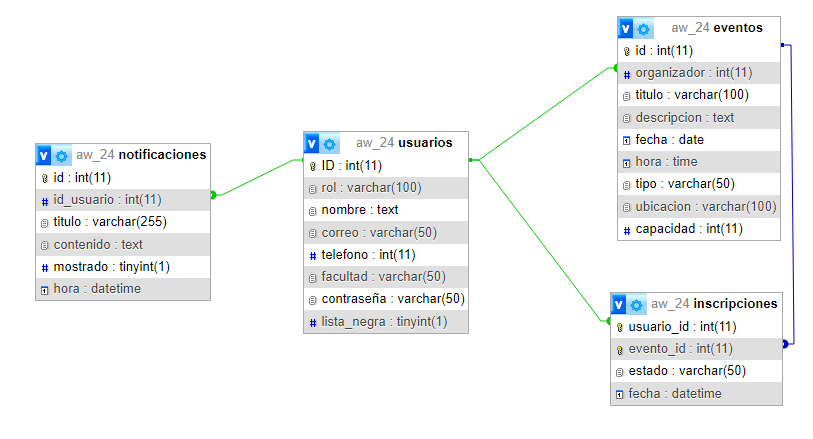

# Eventos UCM

## ¿Qué es Eventos UCM?

Eventos UCM es una web diseñada para que los estudiantes y profesores de la universidad puedan apuntarse y manejar su horario de eventos a la vez que los organizadores de los eventos pueden gestionar las inscripciones y la lista de espera. Cada mensaje que se recibe se guardará en un buzón de notificaciones el cual gestionará a su placer el usuario. Esta página ha sido implementada mediante un servidor local usando Node Js con Express mientras que la base de datos se ha conectado a través de una BBDD de MYSQL local, la cual se ha incluido en el proyecto un archivo para poder replicarla.

## Rutas web:

**/**: landing page, de aqui se accede a todo

- **/calendario**: Muestra el calendario de actividades

- **/inbox**: Muestra el buzón de notificaciones

- **/login**: formulario de login

- **/registro**: formulario para registarse

- **/usuario**: muestra la informacion de perfil del usuario

	- **/eventos**: eventos que maneja el admin

		- **/historial**: muestra el historial de eventos

	- **/inscritos**: eventos en los que esta inscrito el usuario

		- **/historial**: muestra el historial de eventos inscritos del usuario
    
## Base de datos

En este proyecto contamos con una base de datos relacional implementada con MySQL. Esta base de datos costa de 4 tablas: usuarios, eventos, inscripciones y notificaciones. La definición de la base de datos se encuentra [aquí](AW_24.sql). 

Aquí muestro un esquema para que se puedan ver las relaciones entre las tablas y que filas contienen que se ha obtenido usando PHPMyAdmin:

