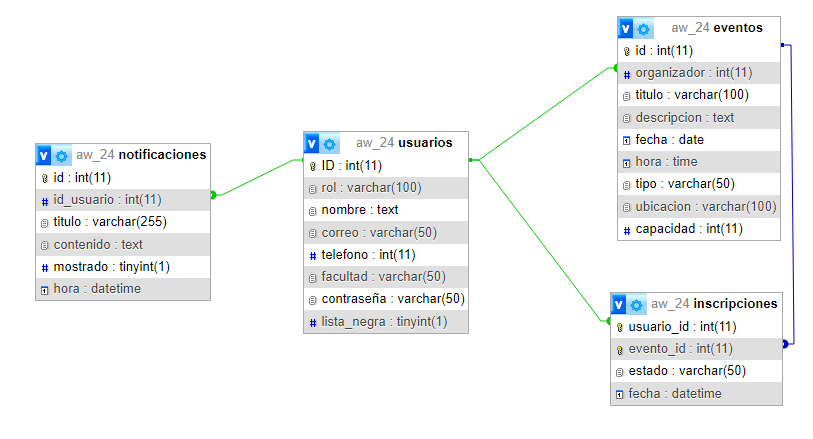

# Eventos UCM

## ¿Qué es Eventos UCM?

Eventos UCM es una web diseñada para que los estudiantes y profesores de la universidad puedan apuntarse y manejar su horario de eventos a la vez que los organizadores de los eventos pueden gestionar las inscripciones y la lista de espera. Cada mensaje que se recibe se guardará en un buzón de notificaciones el cual gestionará a su placer el usuario. Esta página ha sido implementada mediante un servidor local usando Node Js con Express mientras que la base de datos se ha conectado a través de una BBDD de MYSQL local, la cual se ha incluido en el proyecto un archivo para poder replicarla.

### Guía de utilización:

Un usuario primero debe registrarse con su correo UCM y posteriormente hacer "sign-in". 

La pantalla principal es el index, donde un usuario podrá buscar eventos de su interés y filtrar la búsqueda según sus necesidades. En esta página principal el usuario puede apuntarse a eventos, donde se le mostrará un mensaje indicando si se ha apuntado o si está en la lista de espera, asimismo comprobando que este usuario no esté ya registrado en el evento. Desde esta página podemos acceder al resto mediante los botones localizados en el header. Desde ahí se puede acceder al calendario de actividades, al buzón de notificaciones, a los ajustes de accesibilidad y al perfil de usuario. Si el usuario es un administrador también tendrá un botón que le otorgará la posibilidad de crear eventos.

En el perfil de usuario encontramos la información básica del usuario, junto con un botón para modificar esa información y para cerrar sesión. A través de los menús desplegables el usuario podrá ver su historial de eventos al que estuvo inscrito como los que aún están por darse. En los eventos futuros el usuario tiene la opción de desapuntarse si así lo desea. Si el usuario es un organizador, tendrá otro menú desplegable donde podrá ver los eventos que organizó en el pasado junto con su historial de asistentes así como los eventos que están por darse con la opción de gestionar la lista de espera y modificar algún detalle del evento como cancelarlo del todo. 

## Rutas web:

**/**: landing page, de aqui se accede a todo

- **/calendario**: Muestra el calendario de actividades

- **/inbox**: Muestra el buzón de notificaciones

- **/login**: formulario de login

- **/registro**: formulario para registarse

- **/usuario**: muestra la informacion de perfil del usuario

	- **/eventos**: eventos que maneja el admin

		- **/historial**: muestra el historial de eventos

	- **/inscritos**: eventos en los que esta inscrito el usuario

		- **/historial**: muestra el historial de eventos inscritos del usuario
    

## Rutas post:

- **/**: landing page, de aqui se accede a todo

	/set-password: Permite cambiar la contraseña del usuario

	/busqueda: Permite filtrar los resultados en función de distintos parámetros

	/apuntar/:evento: Permite apuntar a un usuario a algún evento

	/nuevoEvento: Permite crear un nuevo evento

- **/inbox**: Muestra el buzón de notificaciones

	/delete-notification: Eliminar notificacion

- **/login**: formulario de login

	/ : Perrmite logearse si los datos coinciden

- **/registro**: formulario para registarse

	/ : Actualiza la BD si todoss los datos están bien añadiendo un nuevo usuario

- **/usuario**: muestra la informacion de perfil del usuario
	
	/ : Ruta para actualizar el perfil del usuario
	
	/cerrar : Permite cerrar la sesión del usuario

	- **/eventos**: eventos que maneja el admin
	
		/modificar/:event_id: Permite modificar uno de tus eventos
	
		/eliminar/:event_id: Permite eliminar uno de tus eventos
	
		/eliminar/:event_id/:user_id: Elimina a un usuario específico de tu evento
	
		- **/cola**: Permite gestionar los usuarios apuntados a uno de tus eventos
		
			/eliminar/:user_id/:event_id: Permite eliminar a un usuario del evento
	
	- **/inscritos**: eventos en los que esta inscrito el usuario

		/desapuntar/:event_id: Permite a los usuarios desapuntarse de un evento específico
    
## Base de datos

En este proyecto contamos con una base de datos relacional implementada con MySQL. Esta base de datos costa de 4 tablas: usuarios, eventos, inscripciones y notificaciones. La definición de la base de datos se encuentra [aquí](resources/AW_24.sql). 

Aquí muestro un esquema para que se puedan ver las relaciones entre las tablas y que filas contienen que se ha obtenido usando PHPMyAdmin:

